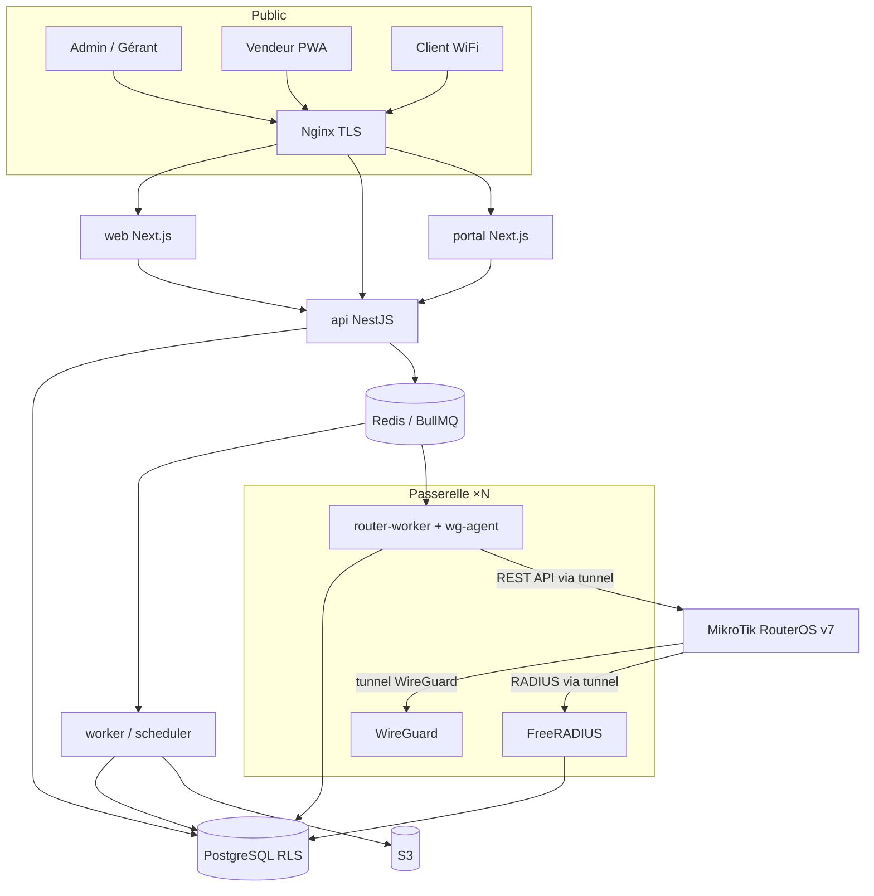
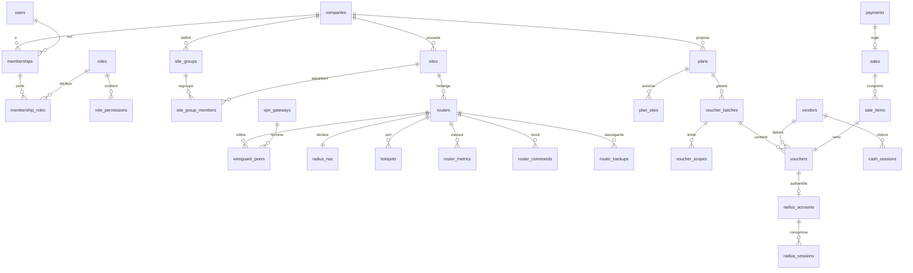

# ECSI CLOUD — Dossier d'architecture v0.1

> **Statut :** proposition à valider (aucun code applicatif écrit).
> **Date :** 3 octobre 2026
> **Dépôt :** `ecsisarl/ecsi-cloud` (vide à ce jour : aucun commit, aucun fichier).
> **Source :** cahier des charges « PROJET : ECSI CLOUD » (36 sections + première mission).

Les commandes RouterOS, attributs RADIUS et API de paiement cités ici sont donnés **à titre d'architecture**. Chaque script ou commande sera écrit et vérifié contre la documentation officielle (help.mikrotik.com pour RouterOS v7, freeradius.org pour FreeRADIUS 3.2, wireguard.com) et testé sur un routeur de laboratoire (MikroTik CHR) avant d'être livré. Les points marqués **⚠ lab** sont précisément ceux qui doivent être validés en laboratoire.

---

## 0. Décisions clés en une page

| Sujet               | Décision proposée                                                                    | Raison principale                                                                   |
| ------------------- | ------------------------------------------------------------------------------------ | ----------------------------------------------------------------------------------- |
| Backend             | **NestJS (TypeScript strict)**, monolithe modulaire                                  | Un seul langage front/back, schémas de validation partagés, DI propre, BullMQ natif |
| Frontend            | **Next.js (App Router) + React + TypeScript + Tailwind + shadcn/ui**                 | Stack demandée ; composants possédés (design propre, pas de thème acheté)           |
| Portail captif      | **Application Next.js séparée et ultra-légère**                                      | Doit rester rapide sur réseau faible, cycle de déploiement indépendant              |
| Base de données     | **PostgreSQL 16+** avec **Row-Level Security**                                       | Isolation des tenants en profondeur, partitionnement natif                          |
| ORM / migrations    | **Drizzle ORM** (+ SQL brut pour RLS, fonctions RADIUS, partitions)                  | Proche du SQL, transactions avec variables de session simples                       |
| Cache / queues      | **Redis 7 + BullMQ**                                                                 | Tâches longues asynchrones, planification, rate limiting                            |
| AAA                 | **FreeRADIUS 3.2** + PostgreSQL, accès par le tunnel WireGuard uniquement            | AAA central dès le départ = base du roaming                                         |
| VPN                 | **WireGuard**, nœuds « passerelles » dédiés, clé privée générée **sur le routeur**   | Fonctionne sans IP publique, la clé privée ne quitte jamais le MikroTik             |
| Accès routeur       | **REST API RouterOS v7** via le tunnel, par des **workers** (jamais le serveur web)  | Pas de connexion permanente serveur web ↔ routeur                                   |
| État ONLINE/OFFLINE | Dérivé du **handshake WireGuard** + accounting RADIUS, pas d'un polling agressif     | Passe à l'échelle des milliers de routeurs                                          |
| Infra               | Docker / Docker Compose, Nginx, MinIO (dev) / S3 (prod), Prometheus + Grafana + Loki | Stack demandée, évolutive vers Kubernetes                                           |
| Monorepo            | **pnpm workspaces + Turborepo**                                                      | Code partagé (types, permissions, client MikroTik)                                  |
| Tests               | Vitest, Testcontainers (Postgres/Redis réels), Playwright, radclient, CHR            | Tests d'intégration sur de vrais services, pas des mocks                            |

**Recommandation qui modifie légèrement le cahier des charges :** intégrer l'**authentification RADIUS des vouchers (portée LOCAL) dans le MVP**, plutôt que de créer d'abord des utilisateurs Hotspot locaux sur chaque routeur puis de tout migrer vers RADIUS. Le roaming GROUPE/GLOBAL arrive au sprint suivant le MVP, mais le schéma et la requête d'autorisation le supportent dès le premier jour. Voir §12 et §16.

---

## 1. Analyse du projet

### 1.1 Ce qu'est ECSI CLOUD

Un **SaaS multi-entreprises** qui joue trois rôles à la fois :

1. **Contrôleur réseau** : il enrôle, supervise et pilote des MikroTik RouterOS v7 situés derrière n'importe quelle connexion (y compris CGNAT, 4G, sans IP publique).
2. **Serveur AAA central** : il authentifie les clients WiFi, applique les forfaits (durée, débit, quota, appareils) et comptabilise la consommation, pour tous les sites de toutes les entreprises.
3. **Système commercial** : forfaits, tickets, vendeurs, caisse, ventes, paiements mobile money, rapports.

La valeur différenciante est la combinaison des trois, en particulier **ECSI Roaming** (un ticket acheté à Korhogo fonctionne à Bouaké), qui n'est possible que si l'AAA est centralisé.

### 1.2 Acteurs

| Acteur           | Interface                          | Besoin principal                                                     |
| ---------------- | ---------------------------------- | -------------------------------------------------------------------- |
| Super admin ECSI | Console plateforme                 | Gérer les entreprises clientes, passerelles VPN, supervision globale |
| Admin entreprise | Dashboard web                      | Tout gérer pour son entreprise                                       |
| Gérant           | Dashboard web (limité à ses sites) | Opérations quotidiennes d'un ou plusieurs sites                      |
| Technicien       | Dashboard web                      | MikroTik, hotspots, monitoring, sans accès financier                 |
| Vendeur          | Web mobile (PWA)                   | Stock de tickets, ventes, caisse du jour                             |
| Comptable        | Dashboard web                      | Ventes, paiements, caisses, rapports, en lecture                     |
| Support          | Dashboard web                      | Recherche client/ticket, sessions, déconnexion                       |
| Client WiFi      | Portail captif                     | Se connecter avec un ticket ou payer un forfait                      |
| MikroTik         | Tunnel WireGuard                   | RADIUS, API REST, provisioning                                       |

### 1.3 Contraintes structurantes

- **Pas d'IP publique côté routeur** : toute communication est initiée par le routeur (tunnel sortant UDP). Le cloud ne joint le routeur qu'à travers ce tunnel.
- **Échelle cible** : centaines d'entreprises, milliers de routeurs, dizaines de milliers de sessions simultanées. Aucun serveur web ne doit maintenir de connexion vers chaque routeur ; tout ce qui est long passe par des queues.
- **Isolation stricte des tenants** : une fuite entre entreprises serait fatale pour un produit commercial.
- **Réseaux faibles** (portail captif sur mobile 3G/4G médiocre) : pages légères, peu de requêtes.
- **Argent liquide** : la majorité des ventes passent par des vendeurs qui manipulent du cash ; la caisse et la traçabilité des tickets sont aussi importantes que le paiement en ligne.
- **Exactitude technique** : aucune commande RouterOS ou endpoint de paiement inventé.

### 1.4 Ambiguïtés relevées dans le cahier des charges

Elles n'empêchent pas de démarrer ; une valeur par défaut est proposée pour chacune (voir §16).

1. **Sémantique de la durée d'un forfait** : « 1 heure » signifie-t-il 1 h de connexion cumulée (on peut se déconnecter et reprendre) ou 1 h calendaire depuis la première connexion ? Proposition : le forfait porte les deux notions séparément (`temps de connexion` et `validité après 1ère utilisation`), l'entreprise choisit.
2. **Moment où un ticket est « vendu »** : quand le vendeur l'enregistre dans l'application, ou à sa première utilisation ? Beaucoup d'exploitants donnent des tickets imprimés aux vendeurs qui ne saisissent rien. Proposition : les deux modes, configurables par entreprise (`vente déclarée` ou `vente à l'activation`).
3. **Caisse** : citée en section 16 mais absente de la liste MVP de la section 35. Proposition : une caisse journalière simple dans le MVP, car les ventes vendeurs n'ont pas de sens sans clôture.
4. **Facturation des entreprises clientes par ECSI** (abonnement SaaS) : non mentionnée. Proposition : V2, mais le modèle de données prévoit un plan d'abonnement et des limites par entreprise.

---

## 2. Risques techniques

| #   | Risque                                                                                                                                            | Impact                                         | Mitigation                                                                                                                                                                                |
| --- | ------------------------------------------------------------------------------------------------------------------------------------------------- | ---------------------------------------------- | ----------------------------------------------------------------------------------------------------------------------------------------------------------------------------------------- |
| R1  | **Commandes RouterOS inexactes ou variant entre versions 7.x**                                                                                    | Routeurs mal configurés, perte d'accès client  | Scripts versionnés, testés sur CHR à chaque version supportée ; version minimale supportée définie après tests ⚠ lab ; validation contre help.mikrotik.com                                |
| R2  | **UDP bloqué ou instable** (certains réseaux mobiles, NAT agressifs)                                                                              | Tunnel WireGuard impossible                    | Keepalive persistant, choix du port côté passerelle ; plan B documenté (tunnel TCP type OpenVPN/SSTP supporté par RouterOS) en V2 si le terrain le justifie                               |
| R3  | **RADIUS = point unique de défaillance**                                                                                                          | Plus aucun client ne peut se connecter         | Deux passerelles RADIUS minimum en production, routeurs configurés avec deux serveurs RADIUS, accounting bufferisé sur disque (mode « detail » de FreeRADIUS) si la base est indisponible |
| R4  | **RADIUS en clair sur Internet** (UDP, secret partagé faible)                                                                                     | Usurpation, interception                       | RADIUS et CoA **exclusivement dans le tunnel WireGuard** ; aucun port RADIUS public                                                                                                       |
| R5  | **Fuite de données entre entreprises**                                                                                                            | Fatal commercialement                          | Triple barrière : scoping applicatif obligatoire, RLS PostgreSQL, clés étrangères composites `(company_id, id)` ; tests automatisés d'isolation sur chaque endpoint                       |
| R6  | **Supervision de milliers de routeurs**                                                                                                           | Saturation workers, latence                    | Statut issu du handshake WireGuard (zéro requête routeur), polling métriques espacé et réparti par passerelle, intervalles adaptatifs                                                     |
| R7  | **Sessions RADIUS orphelines** (routeur redémarré sans paquet Stop)                                                                               | Simultaneous-use bloque le client, quotas faux | Interim-update obligatoire, job de clôture des sessions sans interim depuis N intervalles, détection reboot via Accounting-On/Off                                                         |
| R8  | **Brute force de codes tickets**                                                                                                                  | Vol de connexion                               | Codes à forte entropie, alphabet sans caractères ambigus, limitation des échecs par NAS/MAC, journal post-auth et alertes                                                                 |
| R9  | **Paiements mobile money** : contrats, KYC, docs, fiabilité des webhooks                                                                          | Retard du module, litiges                      | Abstraction `PaymentProvider`, aucun provider sans doc officielle et compte marchand ; webhooks signés et idempotents ; job de réconciliation ; paiement hors MVP                         |
| R10 | **Portail captif sur mobile** (assistants captifs iOS/Android, HTTPS, walled garden)                                                              | Clients bloqués, mauvaise image                | Tests sur vrais terminaux, walled garden généré automatiquement, page de secours hébergée sur le routeur ⚠ lab                                                                            |
| R11 | **Randomisation des adresses MAC** sur Android/iOS récents                                                                                        | MAC binding peu fiable                         | MAC binding optionnel par forfait, documenté comme « au mieux »                                                                                                                           |
| R12 | **Compromission des identifiants API routeur**                                                                                                    | Prise de contrôle de routeurs clients          | Compte API dédié, groupe aux droits minimaux, restreint à l'IP tunnel ; secret chiffré (enveloppe) ; rotation ; actions dangereuses confirmées et journalisées                            |
| R13 | **Contenu sensible des backups RouterOS** (mots de passe, clés)                                                                                   | Fuite de secrets clients                       | Backups chiffrés au repos, accès restreint par permission dédiée, jamais affichés en clair                                                                                                |
| R14 | **Conformité** : loi ivoirienne n° 2013-450 sur les données personnelles (ARTCI) et éventuelles obligations de conservation des logs de connexion | Juridique                                      | Rétention configurable, export d'audit ; **à faire valider par un juriste**, rien n'est supposé ici                                                                                       |
| R15 | **Dérive de périmètre** (le cahier des charges est très large)                                                                                    | Retard, qualité                                | MVP strict (§12), modules reportés explicitement (§13), validation module par module                                                                                                      |

---

## 3. Architecture recommandée

### 3.1 Principes

1. **Monolithe modulaire**, pas de microservices au départ : un seul code backend découpé en modules à frontières nettes (un module = un dossier, ses tables, son API, ses événements). Il se scinde plus tard si un module le justifie. Les microservices dès le départ multiplieraient l'exploitation sans bénéfice à cette échelle.
2. **Plusieurs processus, un seul code** : le même image Docker démarre en `api` (HTTP), `worker` (queues) ou `scheduler` (tâches planifiées).
3. **Les routeurs ne parlent qu'aux passerelles**, les passerelles ne parlent qu'au cœur. Le serveur web n'ouvre jamais de connexion vers un routeur.
4. **Asynchrone par défaut** pour tout ce qui touche un routeur, un PDF, un export, un paiement ou une notification.
5. **Outbox transactionnelle** : un événement métier (vente, paiement validé, ticket activé) est écrit dans la même transaction que la donnée, puis publié par un worker. Aucun événement perdu.

### 3.2 Diagramme général

```
                         Internet public (HTTPS uniquement)
 ┌───────────────┐   ┌──────────────────┐   ┌────────────────────┐
 │ Admin / Gérant│   │ Vendeur (PWA)    │   │ Client WiFi        │
 │ navigateur    │   │ mobile           │   │ (portail captif)   │
 └──────┬────────┘   └────────┬─────────┘   └─────────┬──────────┘
        │ app.<domaine>       │                       │ portal.<domaine>
        ▼                     ▼                       ▼
 ┌─────────────────────────────────────────────────────────────────┐
 │                 Nginx (TLS, rate limiting, WAF de base)         │
 └──────┬──────────────────────┬───────────────────────┬───────────┘
        ▼                      ▼                       ▼
 ┌─────────────┐      ┌──────────────────┐     ┌───────────────┐
 │ web         │      │ api (NestJS)     │◄────┤ portal        │
 │ Next.js     │─────►│ /api/v1, OpenAPI │     │ Next.js léger │
 │ dashboard   │ REST │ WebSocket/SSE    │     └───────────────┘
 └─────────────┘      └───┬─────────┬────┘
                          │         │ jobs (BullMQ)
              ┌───────────┘         ▼
              │           ┌───────────────────┐   ┌──────────────┐
              │           │ worker / scheduler│──►│ S3 (backups, │
              │           │ PDF, exports,     │   │ PDF, logos)  │
              │           │ notifications,    │   └──────────────┘
              │           │ paiements, outbox │
              ▼           └─────────┬─────────┘
 ┌──────────────────────┐           │
 │ PostgreSQL (RLS)     │◄──────────┤          ┌───────────────┐
 │ + partitions         │           └─────────►│ Redis         │
 └──────────▲───────────┘                      │ queues, cache │
            │ SQL (rôles dédiés)               └──────▲────────┘
 ═══════════╪══════════ Zone privée cœur ↔ passerelles═╪═══════════
            │                                         │ queue routeurs
 ┌──────────┴─────────────────────────────────────────┴──────────┐
 │  PASSERELLE (×N, une par shard de routeurs)                   │
 │  ┌────────────┐  ┌──────────────┐  ┌──────────────────────┐   │
 │  │ WireGuard  │  │ FreeRADIUS   │  │ router-worker        │   │
 │  │ wg0        │  │ auth/acct/CoA│  │ REST RouterOS, backup│   │
 │  └─────▲──────┘  └──────▲───────┘  │ + wg-agent (peers,   │   │
 │        │                │          │ handshakes)          │   │
 │        │                │          └──────────▲───────────┘   │
 └────────┼────────────────┼─────────────────────┼───────────────┘
          │  tunnel WireGuard chiffré (UDP sortant depuis le routeur)
 ┌────────┴────────────────┴─────────────────────┴───────────────┐
 │ MikroTik RouterOS v7 (sans IP publique, derrière NAT/CGNAT)   │
 │ Hotspot ─ RADIUS client ─ REST API (écoute tunnel uniquement) │
 └────────────────────────────┬──────────────────────────────────┘
                              │
                     Points d'accès WiFi ─► Clients WiFi
```

La même vue en Mermaid (rendue par GitHub) sera placée dans `docs/ARCHITECTURE.md` :



### 3.3 Composants

| Composant                  | Rôle                                                                              | Échelle                                                          |
| -------------------------- | --------------------------------------------------------------------------------- | ---------------------------------------------------------------- |
| `web`                      | Dashboard SaaS (admins, gérants, techniciens, comptables, support) et PWA vendeur | Sans état, horizontal                                            |
| `portal`                   | Portail captif public, templates par entreprise/site                              | Sans état, cache CDN possible                                    |
| `api`                      | API REST `/api/v1`, auth, RBAC, temps réel (WebSocket/SSE)                        | Sans état, horizontal                                            |
| `worker`                   | Jobs : PDF tickets, exports, rapports, notifications, paiements, outbox           | Horizontal, par queue                                            |
| `scheduler`                | Déclenche les tâches planifiées (une seule instance active, verrou Redis)         | 1 actif                                                          |
| Passerelle `wireguard`     | Termine les tunnels des routeurs de son shard                                     | 1 passerelle ≈ quelques milliers de routeurs                     |
| Passerelle `freeradius`    | Auth, accounting, CoA/Disconnect pour les routeurs de son shard                   | Idem, en paire pour la HA                                        |
| Passerelle `router-worker` | Consomme la queue `router:<passerelle>` : lecture métriques, commandes, backups   | Co-localisé avec WireGuard, donc a une route vers chaque routeur |
| Passerelle `wg-agent`      | Synchronise les peers WireGuard depuis la base, remonte les handshakes            | 1 par passerelle                                                 |
| PostgreSQL                 | Données métier, RADIUS, audit                                                     | Primaire + réplique(s), PITR                                     |
| Redis                      | Queues, cache, rate limiting, pub/sub temps réel                                  | Instance managée ou Sentinel                                     |
| S3                         | Backups routeurs, PDF, exports, logos, images portail                             | Managé                                                           |
| Observabilité              | Prometheus, Grafana, Loki, OpenTelemetry, Sentry/GlitchTip                        | —                                                                |

### 3.4 Flux principaux

**Connexion d'un client avec un ticket**

1. Le client se connecte au WiFi ; le Hotspot MikroTik intercepte et redirige vers la page de login.
2. La page de login du routeur redirige vers `portal.<domaine>` (autorisé dans le walled garden) avec les variables Hotspot (MAC, IP, URL de login du routeur, identifiant du site).
3. Le client saisit son code ; le portail soumet le formulaire **vers l'URL de login du routeur** (le routeur reste l'autorité Hotspot).
4. Le routeur envoie un Access-Request à FreeRADIUS via le tunnel.
5. FreeRADIUS identifie le NAS par son IP tunnel (donc le routeur, le site et l'entreprise), appelle la fonction d'autorisation SQL : ticket valide, portée compatible avec le site (roaming), temps/quota restants, nombre d'appareils.
6. Access-Accept avec les attributs de limitation (durée restante, débit, quota) ; le routeur ouvre la session.
7. Accounting Start / Interim / Stop alimentent `radius_sessions` ; un worker met à jour les compteurs du ticket et son état (`ACTIVE`, puis `EXPIRED`).

**Achat en ligne (après le MVP)**
Portail → choix du forfait → numéro de téléphone → `POST /payments` (clé d'idempotence) → redirection ou push USSD du provider → webhook signé → validation + vérification serveur à serveur → création du ticket + vente dans une transaction → le portail (en attente) reçoit les identifiants et soumet le login automatiquement.

**Commande à distance sur un routeur**
UI → `POST /routers/:id/commands` (si dangereuse : confirmation explicite + raison) → ligne `router_commands` + audit → job sur la queue de la passerelle du routeur → `router-worker` exécute via REST dans le tunnel → résultat stocké, audit complété, notification temps réel à l'UI.

---

## 4. Choix définitif de la stack

### 4.1 Tableau

| Couche           | Choix                                                                                                                                      | Version cible                         |
| ---------------- | ------------------------------------------------------------------------------------------------------------------------------------------ | ------------------------------------- |
| Langage          | TypeScript strict partout (sauf SQL et configs FreeRADIUS)                                                                                 | TS 5.x                                |
| Runtime          | Node.js LTS                                                                                                                                | 22 LTS (ou LTS courante au démarrage) |
| Backend          | NestJS, adaptateur Fastify                                                                                                                 | 11.x                                  |
| Validation       | Zod (schémas partagés front/back via `packages/shared`)                                                                                    | —                                     |
| ORM              | Drizzle ORM + drizzle-kit (migrations SQL versionnées)                                                                                     | —                                     |
| Base             | PostgreSQL                                                                                                                                 | 16 ou 17                              |
| Queues           | BullMQ sur Redis                                                                                                                           | Redis 7                               |
| Auth             | JWT courts + refresh tokens rotatifs (cookie httpOnly), Argon2id, TOTP                                                                     | —                                     |
| Frontend         | Next.js App Router, React, Tailwind CSS, shadcn/ui (Radix), TanStack Query & Table                                                         | Next 15+                              |
| Graphiques       | Apache ECharts (ou Recharts, à trancher au sprint dashboard)                                                                               | —                                     |
| i18n             | next-intl côté front, clés de traduction côté API pour les messages                                                                        | FR par défaut, EN prévu               |
| PDF / QR / Excel | pdf-lib ou PDFKit, `qrcode`, ExcelJS                                                                                                       | —                                     |
| AAA              | FreeRADIUS + rlm_sql PostgreSQL                                                                                                            | 3.2.x                                 |
| VPN              | WireGuard (module noyau Linux)                                                                                                             | —                                     |
| MikroTik         | REST API RouterOS v7 (HTTPS, service `www-ssl` restreint au tunnel) ; API binaire (8729) seulement si un besoin n'est pas couvert par REST | RouterOS ≥ 7.x (minimum fixé en lab)  |
| Reverse proxy    | Nginx                                                                                                                                      | —                                     |
| Stockage objet   | MinIO en dev, S3 compatible managé en prod                                                                                                 | —                                     |
| Observabilité    | OpenTelemetry, Prometheus, Grafana, Loki, Sentry ou GlitchTip                                                                              | —                                     |
| Tests            | Vitest, Supertest, Testcontainers, Playwright, `radclient`, CHR en VM                                                                      | —                                     |
| CI/CD            | GitHub Actions → images sur GHCR → déploiement Compose/Ansible                                                                             | —                                     |
| Monorepo         | pnpm workspaces + Turborepo                                                                                                                | —                                     |

### 4.2 Choix et compromis

**NestJS plutôt que Laravel.**
Laravel est excellent (Horizon, Sanctum, productivité CRUD), mais imposerait deux langages et deux jeux de types pour les mêmes objets (forfait, ticket, permission). Avec NestJS, les schémas Zod, les énumérations d'états et la liste des permissions sont **un seul code** utilisé par l'API, le dashboard, le portail et les workers. NestJS apporte une injection de dépendances et une modularité proches de ce que demande la section 30 (SOLID, modules), ainsi que BullMQ, WebSocket et OpenAPI intégrés. Compromis : il faut assembler soi-même quelques briques que Laravel fournit (auth, admin), ce qui est acceptable et même souhaitable pour la sécurité multi-tenant.

**Drizzle plutôt que Prisma ou TypeORM.**
L'isolation par RLS exige de positionner `app.company_id` dans chaque transaction (`set_config(..., true)`). Drizzle le permet naturellement et reste proche du SQL, ce qui compte pour les fonctions RADIUS, les partitions et les index partiels. Prisma rend ce schéma plus contraint ; TypeORM est moins sûr côté typage. Compromis : écosystème plus jeune que Prisma, compensé par des migrations en SQL lisible.

**Monolithe modulaire.**
Un seul déploiement backend, une base, des frontières de modules strictes (lint d'imports). On ne scinde que lorsqu'un module a des besoins d'échelle propres (le RADIUS est déjà séparé de fait, car c'est FreeRADIUS).

**PostgreSQL partitionné plutôt qu'une base séries temporelles dès le départ.**
Métriques routeurs et accounting dans des tables partitionnées par mois, avec agrégats horaires et journaliers calculés par jobs. TimescaleDB reste une option si le volume l'exige ; pas de dépendance supplémentaire au MVP. Prometheus sert à superviser **la plateforme**, pas les routeurs des clients (cardinalité trop forte et pas multi-tenant).

**REST RouterOS plutôt que l'API binaire.**
REST (disponible depuis RouterOS 7.1) est plus simple à tester et à journaliser. L'API binaire ne sera utilisée que pour un besoin précis non couvert, documenté par un ADR.

**Next.js pour le portail, mais séparé.**
Le portail doit charger vite sur 3G : pages rendues côté serveur ou statiques, quasiment sans JavaScript, objectif < 100 Ko transférés pour la page de login. Le séparer du dashboard évite d'embarquer le bundle du dashboard et permet de le mettre derrière un CDN.

---

## 5. Architecture MikroTik ↔ WireGuard ↔ ECSI CLOUD

### 5.1 Passerelles et adressage

- Une **passerelle** = un serveur Linux public avec une IP fixe, WireGuard, FreeRADIUS, `router-worker` et `wg-agent`.
- Chaque passerelle possède un **sous-réseau tunnel** dédié, configurable, par exemple `10.253.0.0/16` pour la passerelle 1, `10.254.0.0/16` pour la passerelle 2. On évite `100.64.0.0/10`, utilisé par les opérateurs en CGNAT, et les plages LAN les plus courantes.
- Chaque routeur reçoit une **adresse /32** dans le sous-réseau de sa passerelle (unicité garantie par contrainte en base `(gateway_id, tunnel_ip)`).
- Le routeur n'a de route que vers l'adresse tunnel de sa passerelle : il ne voit ni les autres routeurs ni le reste de l'infrastructure. Le pare-feu de la passerelle interdit le trafic routeur ↔ routeur.
- **Propriété de sécurité clé :** le routage cryptographique de WireGuard garantit qu'un paquet venant de l'IP tunnel X a été émis par le détenteur de la clé du peer X. L'IP tunnel est donc une identité fiable du NAS pour RADIUS, même si le routeur change d'IP publique en permanence.

### 5.2 Enrôlement d'un routeur (provisioning)

```
Admin            API / worker                Routeur MikroTik           Passerelle
  │ crée routeur      │                            │                          │
  ├──────────────────►│ choisit passerelle,        │                          │
  │                   │ réserve IP tunnel,         │                          │
  │                   │ génère jeton à usage       │                          │
  │                   │ unique (TTL 30 min),       │                          │
  │                   │ secret RADIUS, compte API  │                          │
  │◄──────────────────┤ commande d'installation    │                          │
  │ colle la commande dans le terminal ──────────► │                          │
  │                   │◄── télécharge le script ───┤ (HTTPS, jeton)           │
  │                   │    (jeton consommé)        │                          │
  │                   │                            │ crée l'interface WG :    │
  │                   │                            │ la clé privée est générée│
  │                   │                            │ SUR le routeur           │
  │                   │◄── envoie sa clé PUBLIQUE ─┤ (HTTPS, jeton de phase 2)│
  │                   │ enregistre le peer ────────┼────────────────────────► │ wg-agent ajoute
  │                   │                            │◄═══ handshake WireGuard ═╡ le peer
  │                   │                            │ configure RADIUS, compte │
  │                   │                            │ API restreint au tunnel, │
  │                   │                            │ service REST sur tunnel  │
  │                   │ détecte le handshake ◄─────┼──────────────────────────┤
  │◄── ONLINE (temps réel) ─┤ lit identité, modèle, version via REST          │
```

Points de conception :

1. **La clé privée WireGuard ne quitte jamais le routeur.** RouterOS génère la paire de clés à la création de l'interface ; le script ne remonte que la clé publique. Le cloud ne stocke que des clés publiques. C'est plus fort que « ne pas afficher la clé privée » : elle n'existe nulle part ailleurs. ⚠ lab : valider la lecture de la clé publique en script et son envoi via `/tool fetch` en POST.
2. **Commande d'installation** : une ligne qui télécharge un script `.rsc` signé d'un jeton à usage unique puis l'importe (forme indicative : `/tool fetch url="https://…/provision/<jeton>" dst-path=ecsi.rsc` puis `/import file-name=ecsi.rsc`). Le contenu exact du script sera écrit et testé contre la documentation RouterOS v7 ⚠ lab.
3. **Jetons** : stockés hachés, usage unique, expiration courte, liés au routeur ; un jeton expiré ou réutilisé est refusé et journalisé.
4. **Compte API routeur** : utilisateur dédié, groupe aux politiques minimales nécessaires, restreint à l'adresse de la passerelle ; mot de passe aléatoire long, chiffré en base (chiffrement enveloppe, §14).
5. **Idempotence** : rejouer le script sur un routeur déjà enrôlé ne crée pas de doublons (le script vérifie l'existence des objets avant de les créer).
6. **Désenrôlement** : un script de retrait est fourni ; côté cloud, révocation du peer.

### 5.3 Supervision

| Information                      | Source                                                                | Fréquence                                              |
| -------------------------------- | --------------------------------------------------------------------- | ------------------------------------------------------ |
| ONLINE / OFFLINE                 | `wg-agent` : âge du dernier handshake (keepalive 25 s côté routeur)   | Toutes les 30 s, sans contacter le routeur             |
| Version, modèle, numéro de série | REST (ressource système, routerboard)                                 | À l'enrôlement, puis quotidien et à chaque reconnexion |
| Uptime, CPU, RAM, température    | REST (ressources système, santé si le matériel la fournit)            | 60 s par défaut, adaptatif                             |
| Interfaces, trafic, WAN          | REST (interfaces, compteurs)                                          | 60 à 300 s                                             |
| Clients connectés, état Hotspot  | Accounting RADIUS (source de vérité) + REST si besoin d'un instantané | Temps réel via accounting                              |
| Historique connexions            | Table `router_status_events` (transitions ONLINE/OFFLINE)             | Événementiel                                           |

- Le polling est **réparti par passerelle** (chaque `router-worker` ne gère que ses routeurs) et étalé dans le temps (jitter) pour éviter les pics.
- Les métriques brutes sont conservées 7 à 30 jours, puis agrégées (heure, jour).
- Les alertes (offline, CPU élevé, mémoire faible, tunnel down, WAN down) sont générées par des règles évaluées côté worker, avec hystérésis pour éviter le bruit.

### 5.4 Révocation et renouvellement des clés

- **Révocation** : `wireguard_peers.revoked_at` renseigné → `wg-agent` retire le peer en quelques secondes → le routeur est OFFLINE et ne peut plus joindre RADIUS. Audit obligatoire.
- **Renouvellement** : un job génère un nouveau jeton ; le routeur crée une nouvelle paire de clés et remonte la nouvelle clé publique ; l'ancien peer est retiré après le premier handshake du nouveau (bascule sans coupure) ⚠ lab.
- **Migration de passerelle** (rééquilibrage) : même mécanisme, avec nouvelle IP tunnel.

### 5.5 Actions à distance

- Classées en **lecture** (aucune confirmation), **modification** (permission requise) et **dangereuses** (reboot, restauration, reset, modification du Hotspot ou du pare-feu, désenrôlement).
- Une action dangereuse exige : la permission spécifique, une **confirmation explicite** (saisie du nom du routeur), une raison, et est journalisée avant et après exécution. Option entreprise : double validation par un second administrateur.
- Exécution exclusivement par `router-worker` via la queue ; timeout et résultat stockés dans `router_commands`.

### 5.6 Backups MikroTik (architecture ; livraison V1.1)

- Deux formats : backup binaire RouterOS (restauration complète, chiffré par mot de passe) et export texte de configuration (lisible, comparable entre versions, les champs sensibles sont masqués par défaut en v7) ⚠ lab.
- Le `router-worker` déclenche la création, récupère le fichier via le tunnel, le chiffre (clé propre à l'entreprise) et le dépose en S3. Le fichier est ensuite supprimé du routeur.
- Rétention configurable (quotidien ×7, hebdomadaire ×4, mensuel ×12 par défaut).
- Restauration : action dangereuse (§5.5), avec comparaison de version RouterOS et confirmation.

---

## 6. Architecture FreeRADIUS

### 6.1 Déploiement

- FreeRADIUS 3.2 sur chaque passerelle, **en écoute uniquement sur l'interface WireGuard**.
- Les routeurs d'une passerelle sont configurés avec deux serveurs RADIUS : leur passerelle principale et une passerelle secondaire (deuxième tunnel en V1.1 ; au MVP, une paire FreeRADIUS derrière la même passerelle suffit).
- Connexion à PostgreSQL avec un **rôle dédié `radius`** qui n'a accès qu'au schéma `radius` (vues et fonctions) et en écriture qu'à l'accounting.
- **Accounting bufferisé** : FreeRADIUS écrit d'abord dans un fichier « detail » local puis le rejoue en base. Si PostgreSQL est indisponible, l'accounting n'est pas perdu (mécanisme standard de FreeRADIUS, ⚠ lab pour la configuration exacte).

### 6.2 Identification du NAS

- La table `radius_nas` (alimentée par l'enrôlement) associe IP tunnel → routeur → site → entreprise, avec un secret RADIUS propre à chaque routeur.
- FreeRADIUS charge ces clients depuis SQL ; les nouveaux routeurs sont pris en compte sans redémarrage via le mécanisme de clients dynamiques ⚠ lab.

### 6.3 Autorisation (cœur du roaming)

Plutôt que les tables génériques `radcheck`/`radreply` recopiées pour chaque ticket, l'autorisation passe par une **fonction SQL** `radius.authorize(nas_ip, username)` appelée par les requêtes personnalisées de rlm_sql. Elle renvoie les paires attribut/valeur attendues par FreeRADIUS et applique, dans cet ordre :

1. NAS connu et actif → entreprise et site.
2. Compte RADIUS de **cette entreprise** avec ce nom d'utilisateur (l'unicité est par entreprise, pas globale).
3. État du ticket : `SOLD` ou `ACTIVE` (ou `ASSIGNED` en mode « vente à l'activation »), non `DISABLED`, non `EXPIRED`.
4. **Portée** : `LOCAL` → site du ticket = site du NAS ; `GROUP` → site du NAS ∈ groupe(s) du ticket ; `GLOBAL` → site du NAS ∈ sites autorisés du forfait.
5. Validité calendaire restante (depuis la première utilisation ou date d'expiration absolue).
6. Temps de connexion restant et quota data restant (compteurs maintenus par l'accounting).
7. MAC binding si le forfait l'exige.

Attributs de réponse (dictionnaire standard + dictionnaire MikroTik fourni par FreeRADIUS) : `Session-Timeout` (minimum entre temps restant et validité restante), `Idle-Timeout`, `Acct-Interim-Interval`, `Mikrotik-Rate-Limit` (débit montant/descendant), `Mikrotik-Total-Limit` et `Mikrotik-Total-Limit-Gigawords` (quota). Le format exact de chaque attribut côté RouterOS sera vérifié ⚠ lab.

**Simultaneous-use** : vérifié par FreeRADIUS à partir des sessions ouvertes dans `radius_sessions` (requête de comptage de sessions), limité par `max_devices` du forfait.

### 6.4 Accounting

- `radius_sessions` : équivalent enrichi de `radacct` (entreprise, site, routeur, compte, MAC, IP, octets, durée, cause de fin), **partitionnée par mois**, clé unique sur l'identifiant de session unique.
- Start / Interim (toutes les 5 min par défaut) / Stop mettent à jour les compteurs du compte (`used_seconds`, `used_bytes`, `first_used_at`) : c'est ce qui rend le roaming exact (la consommation à Bouaké se déduit de celle de Korhogo).
- Accounting-On/Off (redémarrage NAS) ferme les sessions ouvertes du routeur.
- Job de nettoyage des sessions sans interim depuis 3 intervalles.
- `radius_postauth` journalise les acceptations et refus (utile pour le support et la détection de brute force).

### 6.5 Déconnexion et changement de droits (CoA)

- « Déconnecter ce client » envoie un **Disconnect-Request** (RFC 5176) depuis la passerelle vers l'IP tunnel du routeur, port CoA, ce qui nécessite d'activer la réception RADIUS entrante sur le routeur dans le script d'enrôlement ⚠ lab.
- Même mécanisme pour couper une session quand un ticket est désactivé.

### 6.6 Évolution PPPoE

Le compte RADIUS est générique (`kind = VOUCHER | SUBSCRIBER`). Les abonnés PPPoE de la V2 réutiliseront la même chaîne AAA avec un autre type de compte, sans refonte.

---

## 7. Modèle multi-tenant et RBAC

### 7.1 Stratégie d'isolation : base partagée, schéma partagé, `company_id` + RLS

| Option                                        | Verdict                                                                                                                  |
| --------------------------------------------- | ------------------------------------------------------------------------------------------------------------------------ |
| Une base par entreprise                       | Rejetée : coûteuse en exploitation à des centaines de tenants, migrations lourdes, roaming et vues plateforme compliqués |
| Un schéma par entreprise                      | Rejetée : mêmes problèmes de migration, pool de connexions fragmenté                                                     |
| **Schéma partagé, `company_id` partout, RLS** | **Retenue** : simple à exploiter, efficace à l'échelle, isolation forte en profondeur                                    |

Trois barrières indépendantes :

1. **Applicative** : chaque requête passe par un contexte tenant résolu depuis le jeton (jamais depuis un paramètre client). Les repositories exigent ce contexte ; un lint interdit l'accès direct à la base hors repositories.
2. **Base de données (RLS)** : toutes les tables tenant ont une politique `company_id = current_setting('app.company_id')::uuid`. L'API se connecte avec un rôle **sans** privilège de contournement ; chaque transaction positionne `app.company_id` (local à la transaction). Une requête oubliée sans filtre renvoie zéro ligne au lieu des données d'un autre tenant.
3. **Intégrité référentielle** : les clés étrangères entre tables tenant sont **composites** `(company_id, id)`. Il est donc physiquement impossible qu'un ticket de l'entreprise A référence un forfait de l'entreprise B.

Le super admin utilise un rôle et un contexte distincts (`app.platform_admin`), tracés dans l'audit. Le rôle `radius` traverse les tenants mais uniquement via des fonctions qui dérivent l'entreprise du NAS.

Tests obligatoires : une suite d'isolation automatisée crée deux entreprises et vérifie, pour **chaque endpoint**, qu'aucune ressource de l'autre n'est lisible ni modifiable.

### 7.2 Hiérarchie et rattachement

```
Plateforme (super admin ECSI)
└── Entreprise (company)
    ├── Groupes de sites (roaming GROUPE)
    ├── Sites (WiFi Zones)
    │   └── Routeurs ── Hotspots
    ├── Membres (users ↔ entreprise, avec rôles et portée par site)
    │   ├── Gérants, techniciens, comptables, support
    │   └── Vendeurs (profil vendeur rattaché à un site)
    └── Clients WiFi (comptes RADIUS / tickets)
```

Un utilisateur est **global** (une adresse e-mail) et peut être membre de plusieurs entreprises (cas d'un technicien prestataire). Il choisit l'entreprise active à la connexion.

### 7.3 RBAC

- **Permissions** : chaînes stables `ressource.action`, définies dans le code (`packages/shared/permissions`), par exemple `routers.read`, `routers.command.dangerous`, `vouchers.generate`, `vouchers.disable`, `sales.read`, `cash.close`, `cash.validate`, `reports.export`, `audit.read`.
- **Rôles** : modèles système non supprimables (SUPER_ADMIN, ADMIN_ENTREPRISE, GERANT, TECHNICIEN, VENDEUR, COMPTABLE, SUPPORT) copiés dans chaque entreprise, que l'admin peut ajuster, plus des rôles personnalisés.
- **Portée** : une attribution de rôle peut être limitée à un ou plusieurs sites (un gérant ne voit que ses sites). La vérification combine permission + portée.
- **Contrôle** : garde NestJS déclarative (`@RequirePermission('vouchers.generate')`), et le même référentiel côté front pour masquer ce qui n'est pas permis (le front ne fait jamais foi).

Matrice par défaut (extrait) :

| Permission                 | ADMIN_ENT. |  GERANT   |  TECHNICIEN   |  VENDEUR  | COMPTABLE | SUPPORT |
| -------------------------- | :--------: | :-------: | :-----------: | :-------: | :-------: | :-----: |
| Sites gérer                |     ✓      | ses sites |    lecture    |     —     |  lecture  | lecture |
| Routeurs lire              |     ✓      |     ✓     |       ✓       |     —     |     —     |    ✓    |
| Routeurs action dangereuse |     ✓      |     —     | ✓ (confirmée) |     —     |     —     |    —    |
| Forfaits gérer             |     ✓      |  lecture  |       —       |  lecture  |  lecture  | lecture |
| Tickets générer            |     ✓      |     ✓     |       —       |     —     |     —     |    —    |
| Tickets vendre             |     ✓      |     ✓     |       —       | son stock |     —     |    —    |
| Tickets désactiver         |     ✓      |     ✓     |       —       |     —     |     —     |    ✓    |
| Caisse clôturer            |     ✓      |     ✓     |       —       | la sienne |     —     |    —    |
| Caisse valider             |     ✓      |     ✓     |       —       |     —     |     ✓     |    —    |
| Rapports / exports         |     ✓      | ses sites |       —       | les siens |     ✓     |    —    |
| Audit lire                 |     ✓      |     —     |       —       |     —     |     ✓     |    —    |
| Utilisateurs gérer         |     ✓      |     —     |       —       |     —     |     —     |    —    |

---

## 8. Schéma de base de données

### 8.1 Conventions

- Clés primaires **UUID v7** (triables dans le temps, bons index), générées côté application.
- `created_at`, `updated_at` (`timestamptz`, UTC) sur toutes les tables ; `deleted_at` (suppression logique) sur les entités administrables (entreprises, sites, routeurs, forfaits, utilisateurs, vendeurs) ; **jamais** sur les ventes, paiements, sessions et audit (immuables).
- `company_id` sur toute table tenant, en tête des index composites et des contraintes d'unicité.
- **Montants** en entiers (`bigint`) en unité mineure + code devise ISO 4217. Le FCFA d'Afrique de l'Ouest est `XOF`, sans décimales.
- Énumérations PostgreSQL pour les états (ou `text` + contrainte `CHECK`, à trancher dans l'ADR base de données).
- Fuseau horaire par entreprise (défaut `Africa/Abidjan`) pour les dates métier (journée de caisse, rapports).
- Tables volumineuses partitionnées par mois : `radius_sessions`, `radius_postauth`, `router_metrics`, `audit_logs`.
- Schémas PostgreSQL : `public` (métier), `radius` (vues et fonctions pour FreeRADIUS), `platform` (super admin).

### 8.2 Tables

Légende : **PK** clé primaire, **FK** clé étrangère, **U** unique, **IX** index.

#### Plateforme et entreprises

| Table          | Colonnes principales                                                                                                                                                                                                                                             | Contraintes / index                         |
| -------------- | ---------------------------------------------------------------------------------------------------------------------------------------------------------------------------------------------------------------------------------------------------------------- | ------------------------------------------- |
| `companies`    | id, name, slug, legal_name, logo_file_id, phone, whatsapp, email, address, country_code, timezone, default_currency, settings (jsonb : mode de vente, politiques), saas_plan, limits (jsonb : routeurs max…), status (ACTIVE, SUSPENDED), timestamps, deleted_at | U slug                                      |
| `vpn_gateways` | id, name, public_endpoint, listen_port, public_key, tunnel_cidr, region, capacity, status                                                                                                                                                                        | U name ; table plateforme (sans company_id) |
| `files`        | id, company_id, kind (LOGO, PORTAL_IMAGE, BACKUP, EXPORT, PDF), s3_key, mime, size, checksum, encrypted, created_by                                                                                                                                              | IX (company_id, kind)                       |

#### Identité, sessions, RBAC

| Table                   | Colonnes principales                                                                                                            | Contraintes / index                 |
| ----------------------- | ------------------------------------------------------------------------------------------------------------------------------- | ----------------------------------- |
| `users`                 | id, email, phone, password_hash (Argon2id), full_name, locale, is_platform_admin, status, last_login_at, timestamps, deleted_at | U lower(email)                      |
| `user_mfa`              | user_id, totp_secret_enc, enabled_at, recovery_codes_hash (jsonb)                                                               | PK user_id                          |
| `auth_sessions`         | id, user_id, company_id, refresh_token_hash, family_id, ip, user_agent, expires_at, revoked_at, last_used_at                    | IX user_id ; U refresh_token_hash   |
| `password_reset_tokens` | id, user_id, token_hash, expires_at, used_at                                                                                    | U token_hash                        |
| `memberships`           | id, company_id, user_id, status (INVITED, ACTIVE, DISABLED), invited_by, timestamps                                             | U (company_id, user_id)             |
| `permissions`           | code (PK), module, description, is_dangerous                                                                                    | catalogue issu du code              |
| `roles`                 | id, company_id (null = modèle système), code, name, is_system, timestamps                                                       | U (company_id, code)                |
| `role_permissions`      | role_id, permission_code                                                                                                        | PK (role_id, permission_code)       |
| `membership_roles`      | id, company_id, membership_id, role_id, site_id (null = toute l'entreprise)                                                     | U (membership_id, role_id, site_id) |

#### Sites et groupes

| Table                | Colonnes principales                                                                                        | Contraintes / index                         |
| -------------------- | ----------------------------------------------------------------------------------------------------------- | ------------------------------------------- |
| `sites`              | id, company_id, name, code, location_label, city, gps (optionnel), timezone, status, timestamps, deleted_at | U (company_id, code)                        |
| `site_groups`        | id, company_id, name, description                                                                           | U (company_id, name)                        |
| `site_group_members` | company_id, site_group_id, site_id                                                                          | PK (site_group_id, site_id) ; FK composites |

#### Routeurs, WireGuard, supervision

| Table                             | Colonnes principales                                                                                                                                                                                                                    | Contraintes / index                                                                                                         |
| --------------------------------- | --------------------------------------------------------------------------------------------------------------------------------------------------------------------------------------------------------------------------------------- | --------------------------------------------------------------------------------------------------------------------------- |
| `routers`                         | id, company_id, site_id, name, serial_number, model, board_name, routeros_version, architecture, status (PENDING, PROVISIONING, ONLINE, OFFLINE, REVOKED), last_seen_at, api_username, api_secret_enc, api_port, timestamps, deleted_at | U (company_id, name) ; IX (company_id, site_id) ; IX status                                                                 |
| `router_provisioning_tokens`      | id, company_id, router_id, phase (BOOTSTRAP, KEY_REGISTRATION, ROTATION), token_hash, expires_at, used_at, used_from_ip                                                                                                                 | U token_hash                                                                                                                |
| `wireguard_peers`                 | id, company_id, router_id, gateway_id, public_key, tunnel_ip, allowed_ips, keepalive_seconds, status, last_handshake_at, rx_bytes, tx_bytes, created_at, revoked_at                                                                     | U (gateway_id, tunnel_ip) ; U public_key ; un seul peer actif par routeur (index unique partiel `WHERE revoked_at IS NULL`) |
| `router_status_events`            | id, company_id, router_id, from_status, to_status, reason, occurred_at                                                                                                                                                                  | IX (router_id, occurred_at)                                                                                                 |
| `router_metrics` _(partitionnée)_ | company_id, router_id, ts, cpu_load, mem_used, mem_total, temperature, uptime_s, rx_bps, tx_bps, active_sessions                                                                                                                        | PK (router_id, ts) ; partition mensuelle                                                                                    |
| `router_metrics_hourly`           | mêmes colonnes agrégées (min/moy/max)                                                                                                                                                                                                   | PK (router_id, hour)                                                                                                        |
| `router_interfaces`               | id, company_id, router_id, name, type, mac, running, disabled, is_wan, rx_bytes, tx_bytes, updated_at                                                                                                                                   | U (router_id, name)                                                                                                         |
| `router_commands`                 | id, company_id, router_id, type, payload (jsonb, sans secret), is_dangerous, reason, requested_by, confirmed_at, approved_by, status (QUEUED, RUNNING, SUCCEEDED, FAILED, TIMEOUT), result (jsonb), started_at, finished_at             | IX (router_id, created_at)                                                                                                  |
| `router_backups`                  | id, company_id, router_id, kind (BINARY, EXPORT), trigger (MANUAL, SCHEDULED), file_id, routeros_version, size, checksum, status, retention_class, expires_at                                                                           | IX (router_id, created_at)                                                                                                  |

#### Hotspot et portail

| Table                   | Colonnes principales                                                                                                                                                   | Contraintes / index     |
| ----------------------- | ---------------------------------------------------------------------------------------------------------------------------------------------------------------------- | ----------------------- |
| `hotspots`              | id, company_id, site_id, router_id, name, interface, dns_name, login_mode, use_radius, portal_config_id, status, last_synced_at, timestamps                            | U (router_id, name)     |
| `walled_garden_entries` | id, company_id, hotspot_id (null = défaut entreprise), host_pattern, purpose                                                                                           | —                       |
| `portal_templates`      | id, code, name, version, schema (jsonb des champs personnalisables)                                                                                                    | table plateforme        |
| `portal_configs`        | id, company_id, site_id (null = entreprise), template_id, theme (jsonb : couleurs, logo, images, SSID affiché, téléphone, WhatsApp, message, promotions), published_at | U (company_id, site_id) |

#### Forfaits et tickets

| Table             | Colonnes principales                                                                                                                                                                                                                                                                                                                                         | Contraintes / index                                                            |
| ----------------- | ------------------------------------------------------------------------------------------------------------------------------------------------------------------------------------------------------------------------------------------------------------------------------------------------------------------------------------------------------------ | ------------------------------------------------------------------------------ |
| `plans`           | id, company_id, name, description, price_amount, currency, session_time_seconds (temps de connexion, null = illimité), validity_seconds (après 1ère utilisation), rate_down_kbps, rate_up_kbps, data_quota_bytes, max_devices, mac_binding, default_scope (LOCAL, GROUP, GLOBAL), sort_order, is_public (visible au portail), status, timestamps, deleted_at | U (company_id, name)                                                           |
| `plan_sites`      | company_id, plan_id, site_id                                                                                                                                                                                                                                                                                                                                 | PK (plan_id, site_id) : sites où le forfait est vendable/utilisable            |
| `voucher_batches` | id, company_id, plan_id, site_id (site d'émission), quantity, scope_type, code_format (longueur, alphabet, préfixe), auth_mode (CODE, USER_PASS), created_by, pdf_file_id, expires_at (stock non vendu), created_at                                                                                                                                          | IX (company_id, created_at)                                                    |
| `voucher_scopes`  | id, company_id, batch_id, site_id ou site_group_id (l'un des deux)                                                                                                                                                                                                                                                                                           | CHECK exactement un des deux renseigné                                         |
| `vouchers`        | id, company_id, batch_id, plan_id, site_id, code, password (si USER_PASS), state (AVAILABLE, ASSIGNED, SOLD, ACTIVE, EXPIRED, DISABLED), assigned_vendor_id, assigned_at, sold_at, sale_id, activated_at, expires_at, disabled_at, disabled_by, disabled_reason, timestamps                                                                                  | U (company_id, code) ; IX (company_id, state) ; IX (assigned_vendor_id, state) |
| `voucher_events`  | id, company_id, voucher_id, from_state, to_state, actor_user_id, actor_type, occurred_at                                                                                                                                                                                                                                                                     | IX (voucher_id, occurred_at) : historique complet du cycle de vie              |

Note sur le stockage des codes : un ticket est un titre au porteur qui doit pouvoir être réimprimé, et l'authentification CHAP du Hotspot exige le mot de passe en clair côté RADIUS. Les codes sont donc stockés en clair **dans une colonne accessible uniquement au module tickets et au rôle `radius`** (droits de colonnes + RLS), jamais renvoyés en masse par l'API hors export PDF autorisé et audité. Si le login se fait en PAP sur HTTPS, un stockage haché devient possible ; c'est une option à étudier en lab.

#### RADIUS

| Table                              | Colonnes principales                                                                                                                                                                                                                                     | Contraintes / index                                                                                              |
| ---------------------------------- | -------------------------------------------------------------------------------------------------------------------------------------------------------------------------------------------------------------------------------------------------------- | ---------------------------------------------------------------------------------------------------------------- |
| `radius_nas`                       | id, company_id, router_id, site_id, gateway_id, nas_ip (= IP tunnel), secret_enc, shortname, status                                                                                                                                                      | U nas_ip                                                                                                         |
| `radius_accounts`                  | id, company_id, kind (VOUCHER, SUBSCRIBER), username, voucher_id, subscriber_id (V2), status, bound_mac, first_used_at, used_seconds, used_bytes, last_session_at                                                                                        | U (company_id, username)                                                                                         |
| `radius_sessions` _(partitionnée)_ | id, company_id, site_id, router_id, account_id, username, acct_session_id, acct_unique_id, nas_ip, framed_ip, calling_station_id (MAC), start_at, last_interim_at, stop_at, session_seconds, input_bytes, output_bytes, terminate_cause, partition_month | U (acct_unique_id, partition_month) ; IX (account_id) WHERE stop_at IS NULL ; IX (company_id, site_id, start_at) |
| `radius_postauth` _(partitionnée)_ | id, company_id, nas_ip, username, result (ACCEPT, REJECT), reason, calling_station_id, created_at                                                                                                                                                        | IX (nas_ip, created_at)                                                                                          |
| Schéma `radius`                    | vues `radius.nas`, fonction `radius.authorize(nas_ip, username)`, fonction `radius.accounting(...)`                                                                                                                                                      | rôle `radius` limité à ce schéma                                                                                 |

#### Vendeurs, ventes, caisse

| Table                    | Colonnes principales                                                                                                                                                                                                                                                                                                           | Contraintes / index                                                 |
| ------------------------ | ------------------------------------------------------------------------------------------------------------------------------------------------------------------------------------------------------------------------------------------------------------------------------------------------------------------------------ | ------------------------------------------------------------------- |
| `vendors`                | id, company_id, membership_id, site_id, code, display_name, phone, commission_type (PERCENT, FIXED_PER_TICKET), commission_value, stock_alert_threshold, status, timestamps, deleted_at                                                                                                                                        | U (company_id, code) ; U membership_id                              |
| `vendor_stock_movements` | id, company_id, vendor_id, voucher_id, type (ASSIGN, RETURN, TRANSFER_OUT, TRANSFER_IN), actor_user_id, cash_session_id, created_at                                                                                                                                                                                            | IX (vendor_id, created_at)                                          |
| `sales`                  | id, company_id, site_id, vendor_id (null si en ligne), channel (VENDOR_CASH, ONLINE, ADMIN), total_amount, currency, payment_id, cash_session_id, customer_phone, sold_by_user_id, created_at                                                                                                                                  | IX (company_id, created_at) ; IX (vendor_id, created_at) ; immuable |
| `sale_items`             | id, company_id, sale_id, voucher_id, plan_id, unit_price, commission_amount                                                                                                                                                                                                                                                    | U voucher_id (un ticket n'est vendu qu'une fois)                    |
| `cash_sessions`          | id, company_id, vendor_id, site_id, business_date, status (OPEN, CLOSED, VALIDATED, DISPUTED), opening_stock_count, received_count, sold_count, returned_count, closing_stock_count, expected_amount, declared_amount, variance_amount, commission_amount, amount_due, closed_at, closed_by, validated_at, validated_by, notes | U (vendor_id, business_date)                                        |

#### Paiements (architecture au MVP, intégration V1.1)

| Table                      | Colonnes principales                                                                                                                                                                                                           | Contraintes / index                                                     |
| -------------------------- | ------------------------------------------------------------------------------------------------------------------------------------------------------------------------------------------------------------------------------ | ----------------------------------------------------------------------- |
| `payment_providers`        | code (PK : WAVE, ORANGE_MONEY, MTN_MOMO, …), name, status, supported_currencies                                                                                                                                                | catalogue plateforme                                                    |
| `company_payment_accounts` | id, company_id, provider_code, credentials_enc, webhook_secret_enc, mode (SANDBOX, LIVE), status                                                                                                                               | U (company_id, provider_code, mode)                                     |
| `payments`                 | id, company_id, site_id, plan_id, provider_code, amount, currency, customer_phone, status (PENDING, SUCCEEDED, FAILED, EXPIRED, REFUNDED), idempotency_key, provider_reference, client_mac, voucher_id, expires_at, timestamps | U (company_id, idempotency_key) ; U (provider_code, provider_reference) |
| `payment_transactions`     | id, company_id, payment_id, type (INIT, WEBHOOK, VERIFY, REFUND), request_redacted, response_redacted, status, created_at                                                                                                      | IX payment_id                                                           |
| `webhook_events`           | id, provider_code, provider_event_id, signature_valid, payload_redacted, received_at, processed_at, result                                                                                                                     | U (provider_code, provider_event_id) : idempotence                      |

#### Notifications, alertes, audit, outbox

| Table                                     | Colonnes principales                                                                                                                                                                                                                   | Contraintes / index                                                                                              |
| ----------------------------------------- | -------------------------------------------------------------------------------------------------------------------------------------------------------------------------------------------------------------------------------------- | ---------------------------------------------------------------------------------------------------------------- |
| `alerts`                                  | id, company_id, site_id, router_id, type (ROUTER_OFFLINE, WAN_DOWN, CPU_HIGH, MEMORY_LOW, VPN_DOWN, STOCK_LOW, CASH_NOT_CLOSED…), severity, status (OPEN, ACKNOWLEDGED, RESOLVED), opened_at, acknowledged_by, resolved_at, details    | IX (company_id, status) ; une seule alerte ouverte par (router, type)                                            |
| `notification_channels`                   | id, company_id, type (IN_APP, EMAIL, WHATSAPP, SMS, TELEGRAM, PUSH), config_enc, status                                                                                                                                                | —                                                                                                                |
| `notification_rules`                      | id, company_id, event_type, channel_id, recipients (rôles ou utilisateurs), throttle_seconds                                                                                                                                           | —                                                                                                                |
| `notifications`                           | id, company_id, user_id, channel, event_type, title, body, status (PENDING, SENT, FAILED, READ), sent_at, read_at                                                                                                                      | IX (user_id, status)                                                                                             |
| `audit_logs` _(partitionnée, ajout seul)_ | id, company_id, actor_user_id, actor_type (USER, SYSTEM, AI, ROUTER), action, resource_type, resource_id, ip, user_agent, result (SUCCESS, DENIED, FAILED), metadata (jsonb, secrets masqués), request_id, created_at, prev_hash, hash | IX (company_id, created_at) ; IX (resource_type, resource_id) ; chaîne de hachage pour détecter toute altération |
| `outbox_events`                           | id, company_id, type, payload, created_at, published_at, attempts                                                                                                                                                                      | IX published_at IS NULL                                                                                          |

Les tables V2 (abonnés PPPoE, factures, échéances, tickets support, abonnement SaaS des entreprises, conversations ECSI AI) sont prévues mais non créées au MVP.

### 8.3 Relations principales



Le DDL complet (SQL des migrations, politiques RLS, fonctions RADIUS) sera produit au sprint 0–1 et documenté dans `docs/DATABASE.md`.

---

## 9. Arborescence du repository

```
ecsi-cloud/
├── apps/
│   ├── api/                      # NestJS : HTTP + worker + scheduler (3 points d'entrée)
│   │   ├── src/
│   │   │   ├── main.ts           # serveur HTTP
│   │   │   ├── worker.ts         # consommateurs de queues
│   │   │   ├── scheduler.ts      # tâches planifiées
│   │   │   ├── common/           # tenant context, guards RBAC, filtres d'erreur, logging, audit
│   │   │   ├── database/         # client Drizzle, schémas, migrations SQL, RLS, seeds
│   │   │   └── modules/
│   │   │       ├── auth/  companies/  users/  rbac/  sites/
│   │   │       ├── routers/  wireguard/  monitoring/  hotspots/  portal/
│   │   │       ├── plans/  vouchers/  radius/  vendors/  sales/  cash/
│   │   │       ├── payments/         # PaymentProvider abstrait + providers/
│   │   │       ├── reports/  dashboard/  notifications/  alerts/
│   │   │       ├── backups/  audit/  files/  platform/
│   │   │       └── ai/               # V2 : outils internes contrôlés
│   │   └── test/                 # intégration (Testcontainers) et isolation tenant
│   ├── web/                      # Next.js : dashboard + PWA vendeur
│   │   ├── src/app/(auth)/  (dashboard)/  (vendor)/  (platform)/
│   │   ├── src/components/  src/features/  src/lib/
│   │   └── messages/fr.json  messages/en.json
│   └── portal/                   # Next.js : portail captif ultra-léger, templates
├── services/
│   └── gateway-agent/            # wg-agent + router-worker (Node/TS), déployé sur les passerelles
├── packages/
│   ├── shared/                   # schémas Zod, enums, permissions, types API, utilitaires monétaires
│   ├── mikrotik/                 # client REST RouterOS typé + gabarits de scripts .rsc versionnés
│   ├── ui/                       # design system ECSI (composants, tokens)
│   ├── config-eslint/  config-typescript/
├── infra/
│   ├── docker/                   # Dockerfiles par application
│   ├── nginx/                    # configs dev et prod
│   ├── freeradius/               # sites, mods (sql, detail), requêtes SQL, dictionnaires
│   ├── wireguard/                # gabarits passerelle
│   ├── monitoring/               # prometheus, grafana (dashboards), loki
│   ├── postgres/                 # init, rôles, extensions
│   └── ansible/                  # provisioning serveurs (prod)
├── lab/
│   └── routeros/                 # procédure CHR de test, scénarios d'enrôlement
├── e2e/                          # Playwright
├── docs/
│   ├── ARCHITECTURE.md  DATABASE.md  SECURITY.md  MIKROTIK.md  RADIUS.md
│   ├── API.md  DEPLOYMENT.md  adr/  (décisions d'architecture numérotées)
├── scripts/                      # dev, génération de secrets locaux, seed
├── .github/workflows/            # lint, typecheck, tests, build images, scan secrets
├── docker-compose.yml            # environnement de développement complet
├── docker-compose.lab.yml        # + FreeRADIUS + WireGuard + CHR (optionnel)
├── .env.example
├── README.md  CHANGELOG.md  SECURITY.md (renvoi)  LICENSE (propriétaire)
├── package.json  pnpm-workspace.yaml  turbo.json
└── .gitignore  .editorconfig  .nvmrc
```

Environnement Docker de développement (`docker compose up`) : postgres, redis, minio, mailpit (e-mails de test), api, worker, scheduler, web, portal, nginx ; profil `lab` ajoutant freeradius et une passerelle WireGuard ; Prometheus/Grafana en profil `monitoring`.

---

## 10. EPICS

| Epic                                   | Contenu                                                                                        | Livraison          |
| -------------------------------------- | ---------------------------------------------------------------------------------------------- | ------------------ |
| **E0 Fondations**                      | Monorepo, Docker dev, CI, conventions, design system de base, ADR, docs squelettes             | MVP                |
| **E1 Authentification**                | Login, refresh rotatif, reset mot de passe, invitations, 2FA TOTP admins, gestion des sessions | MVP                |
| **E2 Multi-tenant & RBAC**             | Contexte tenant, RLS, rôles/permissions, portée par site, tests d'isolation                    | MVP                |
| **E3 Entreprises & utilisateurs**      | Profil entreprise, logo, paramètres, membres, console super admin                              | MVP                |
| **E4 Sites**                           | Sites, groupes de sites, statistiques de site                                                  | MVP                |
| **E5 Enrôlement MikroTik & WireGuard** | Passerelle, wg-agent, scripts, jetons, IP tunnel, révocation, renouvellement                   | MVP                |
| **E6 Monitoring & alertes**            | ONLINE/OFFLINE, métriques, interfaces, historique, alertes in-app                              | MVP                |
| **E7 RADIUS central**                  | FreeRADIUS, NAS dynamiques, authorize, accounting, CoA, nettoyage sessions                     | MVP (portée LOCAL) |
| **E8 Hotspot & portail captif**        | Configuration Hotspot via API, walled garden, portail avec templates, login ticket             | MVP                |
| **E9 Forfaits & tickets**              | Forfaits, lots, génération, QR, PDF, cycle de vie, historique                                  | MVP                |
| **E10 Vendeurs, ventes, caisse**       | Vendeurs, stock, ventes, commissions, caisse journalière                                       | MVP                |
| **E11 Dashboard & rapports**           | KPI, graphiques, rapports filtrables, exports PDF/Excel/CSV                                    | MVP                |
| **E12 Audit & sécurité transverse**    | Journal d'audit, rate limiting, en-têtes, chiffrement secrets                                  | MVP                |
| **E13 ECSI Roaming**                   | Portées GROUPE et GLOBAL, UI groupes, rapports de roaming inter-sites                          | V1.1               |
| **E14 Paiements**                      | PaymentProvider, premier provider officiel, webhooks, réconciliation, achat au portail         | V1.1               |
| **E15 Notifications multi-canaux**     | E-mail, puis WhatsApp/SMS/Telegram/Push selon providers                                        | V1.1 → V2          |
| **E16 Backups MikroTik**               | Manuel, planifié, rétention, restauration contrôlée                                            | V1.1               |
| **E17 ECSI AI**                        | Assistant en langage naturel sur outils internes en lecture, confirmations                     | V2                 |
| **E18 PPPoE / ISP**                    | Abonnés, plans, factures, suspension/réactivation, support                                     | V2                 |
| **E19 Abonnement SaaS ECSI**           | Plans ECSI pour les entreprises, limites, facturation                                          | V2                 |

---

## 11. Sprints

Sprints de **2 semaines**. Chaque module suit : PLAN → DATABASE → BACKEND → API → FRONTEND → TESTS → DOCUMENTATION → VALIDATION. Un module critique n'est pas commencé tant que le précédent n'est pas validé par vous.

| Sprint  | Objectif                                                                                                                                | Critère de validation                                                                                 |
| ------- | --------------------------------------------------------------------------------------------------------------------------------------- | ----------------------------------------------------------------------------------------------------- |
| **S0**  | Fondations (E0) : monorepo, Docker dev, CI verte, squelette api/web/portal, design system, ADR initiaux, schéma de base des tables cœur | `docker compose up` démarre tout ; CI lint + typecheck + tests passent                                |
| **S1**  | Auth + multi-tenant + RBAC (E1, E2)                                                                                                     | Connexion, 2FA admin, suite d'isolation tenant verte                                                  |
| **S2**  | Entreprises, utilisateurs, sites, audit (E3, E4, E12 partie audit)                                                                      | Une entreprise crée ses sites et ses membres ; toutes les actions apparaissent dans l'audit           |
| **S3**  | Enrôlement MikroTik + WireGuard (E5)                                                                                                    | Un CHR de lab s'enrôle avec la commande générée et passe ONLINE ; révocation fonctionnelle            |
| **S4**  | Monitoring + alertes in-app (E6)                                                                                                        | Métriques, interfaces, historique, alerte offline en moins de 2 min                                   |
| **S5**  | RADIUS central (E7) + configuration Hotspot (E8 partie routeur)                                                                         | Un utilisateur de test s'authentifie via RADIUS dans le tunnel ; accounting en base ; déconnexion CoA |
| **S6**  | Forfaits + tickets (E9)                                                                                                                 | Génération de 1 000 tickets, PDF avec QR, cycle de vie complet, limites appliquées par RADIUS         |
| **S7**  | Portail captif + clients connectés (E8)                                                                                                 | Login par ticket sur Android et iPhone réels ; liste des clients connectés ; déconnexion              |
| **S8**  | Vendeurs, ventes, caisse (E10)                                                                                                          | Attribution de stock, vente, clôture et validation de caisse avec écart et commission                 |
| **S9**  | Dashboard + rapports + exports (E11)                                                                                                    | KPI exacts sur données de test ; exports PDF/Excel/CSV                                                |
| **S10** | Durcissement : sécurité, E2E, tests de charge RADIUS/API, docs, staging                                                                 | Revue OWASP, E2E critiques verts, charge cible tenue → **livraison MVP**                              |
| **S11** | ECSI Roaming GROUPE/GLOBAL (E13)                                                                                                        | Ticket de Korhogo accepté à Bouaké selon portée ; consommation partagée exacte                        |
| **S12** | Paiements, premier provider (E14)                                                                                                       | Paiement réel en sandbox avec documentation officielle ; webhooks idempotents                         |
| **S13** | Backups MikroTik + notifications e-mail (E16, E15)                                                                                      | Backup planifié chiffré en S3 ; alerte offline par e-mail                                             |

Au-delà : V2 selon priorités commerciales.

---

## 12. Périmètre exact du MVP

### Inclus

1. **Authentification** : login e-mail/mot de passe, refresh rotatif, reset, invitations, **2FA TOTP obligatoire** pour SUPER_ADMIN et ADMIN_ENTREPRISE, liste et révocation des sessions.
2. **Multi-tenant** : isolation applicative + RLS + FK composites, tests d'isolation.
3. **Entreprises** : profil, logo, paramètres (devise, fuseau, mode de vente), console super admin (créer, suspendre).
4. **Utilisateurs/RBAC** : 7 rôles système, rôles personnalisés, portée par site.
5. **Sites** : CRUD, groupes de sites (utilisés au S11), statistiques de site.
6. **Enrôlement MikroTik** : commande d'installation, jetons usage unique, détection automatique.
7. **WireGuard** : une passerelle (deux en production avant ouverture commerciale), clés générées sur le routeur, IP tunnel, révocation, renouvellement, supervision du tunnel.
8. **Monitoring** : ONLINE/OFFLINE, version, modèle, uptime, CPU, RAM, température si disponible, trafic, interfaces, WAN, clients connectés, état Hotspot, historique, alertes **in-app**.
9. **Hotspot** : configuration RADIUS du Hotspot via API, walled garden, sessions, déconnexion, historique. Limites de vitesse, durée, data, appareils, MAC binding, expiration appliquées **par RADIUS**.
10. **RADIUS central** (recommandation) : authentification, autorisation, accounting, simultaneous-use, CoA, **portée LOCAL**. Schéma et fonction d'autorisation prêts pour GROUPE/GLOBAL.
11. **Forfaits** : tous les paramètres de la section 11 du cahier des charges, multi-devise (défaut XOF).
12. **Tickets** : unitaire, en masse, code unique ou identifiant/mot de passe, QR, impression, PDF, attribution vendeur, activation, désactivation, expiration, suivi, 6 états.
13. **Portail captif** : 2 templates, personnalisation (logo, couleurs, images, nom WiFi, téléphone, WhatsApp, message, promotion), login par ticket, responsive, léger.
14. **Vendeurs** : compte, site, stock, ventes, commissions, historique, PWA mobile.
15. **Ventes** : vente vendeur (cash) et vente admin ; mode « vente déclarée » ou « vente à l'activation ».
16. **Caisse journalière** (version simple) : stock initial, reçus, vendus, attendu, déclaré, écart, commission, solde à remettre, clôture, validation.
17. **Dashboard** : CA jour/semaine/mois, tickets vendus/actifs, clients connectés, routeurs ONLINE/OFFLINE, top sites/vendeurs/forfaits, trafic, alertes, graphiques.
18. **Rapports** : journalier, hebdomadaire, mensuel, personnalisé ; filtres entreprise, site, routeur, vendeur, forfait, dates ; exports PDF, Excel, CSV.
19. **Audit logs** : toutes les actions importantes, consultables et exportables.
20. **API** `/api/v1` documentée OpenAPI ; i18n prête (FR livré, EN prévu).

### Exclu du MVP (explicitement)

Paiements en ligne réels, roaming GROUPE/GLOBAL (au S11, juste après), notifications hors in-app, backups MikroTik, ECSI AI, PPPoE, application mobile native, facturation SaaS, domaines personnalisés.

---

## 13. Fonctionnalités reportées

**V1.1 (sprints S11 à S13)** : ECSI Roaming GROUPE/GLOBAL ; premier provider de paiement (choisi selon vos comptes marchands et la documentation officielle disponible : Wave, Orange Money, MTN MoMo ou agrégateur) et achat de forfait au portail ; backups MikroTik manuels et planifiés avec rétention et restauration contrôlée ; notifications e-mail ; seconde passerelle et RADIUS redondant si non fait avant.

**V2** :

- Providers de paiement supplémentaires, cartes bancaires, remboursements, réconciliation avancée.
- Notifications WhatsApp, SMS, Telegram, Push.
- **ECSI AI** : assistant sur outils internes en lecture seule scopés tenant et RBAC ; toute modification proposée demande confirmation et est auditée ; aucun accès direct à la base ni aux routeurs.
- **PPPoE / ISP** : abonnés, plans, factures, échéances, suspension/réactivation automatiques, bandwidth management, tickets support.
- Abonnement SaaS ECSI (plans, limites, facturation des entreprises).
- Application mobile native (vendeur, admin), mode hors ligne vendeur.
- Marque blanche : domaine personnalisé par entreprise pour le dashboard et le portail.
- API publique avec clés API et webhooks sortants pour les entreprises.
- Tunnel de secours TCP pour les réseaux bloquant l'UDP.
- Kubernetes, multi-région, TimescaleDB si le volume l'exige.
- Publicité ciblée sur le portail, statistiques marketing, collecte de leads (avec consentement).

---

## 14. Mesures de sécurité

### Application et API

- HTTPS partout (TLS 1.2+, HSTS), en-têtes de sécurité (CSP stricte, X-Content-Type-Options, frame-ancestors).
- Mots de passe **Argon2id** ; politique de longueur + vérification contre les mots de passe compromis connus (liste locale, sans envoi externe).
- JWT d'accès 15 min, refresh 30 jours **rotatif avec détection de réutilisation** (révocation de toute la famille), cookie httpOnly, Secure, SameSite=Strict ; protection CSRF par double jeton sur les routes cookie.
- **2FA TOTP obligatoire** pour les admins ; codes de récupération hachés ; WebAuthn en V2.
- RBAC + portée par site sur chaque endpoint (garde par défaut « refuser »).
- Validation Zod de toute entrée ; réponses d'erreur normalisées (RFC 9457) sans fuite d'informations internes.
- **Rate limiting** Redis par IP, par utilisateur et par route sensible (login, reset, génération de tickets, portail).
- CORS limité aux origines ECSI connues.
- Clé d'idempotence sur les POST sensibles (ventes, paiements, génération de lots).
- Uploads : types et tailles contrôlés, ré-encodage des images, stockage S3 privé, URLs présignées courtes.

### Données et secrets

- **Chiffrement enveloppe** (AES-256-GCM) des secrets en base : mots de passe API routeur, secrets RADIUS, identifiants providers, secrets TOTP. Clé maître hors base (KMS du fournisseur cloud, ou fichier secret monté) ; rotation possible sans réécriture massive.
- Aucun secret dans Git : `.env` ignoré, `.env.example` sans valeur réelle, **scan de secrets en CI** (gitleaks) et hook pre-commit.
- Secrets de production : Docker secrets + SOPS/age dans un premier temps, gestionnaire dédié (Vault/Infisical) quand l'équipe grandit.
- Rôles PostgreSQL distincts : `app` (RLS appliquée), `radius` (schéma radius), `migrator`, `readonly` (rapports). Aucun superutilisateur applicatif.
- Masquage des secrets dans les logs et l'audit (liste de champs interdits).
- Sauvegardes PostgreSQL chiffrées, PITR, test de restauration mensuel.

### Réseau et routeurs

- API RouterOS et RADIUS **jamais exposés sur Internet** : uniquement dans le tunnel WireGuard ; services du routeur restreints à l'adresse de la passerelle.
- Passerelles : pare-feu par défaut « refuser », seuls UDP WireGuard et SSH (clé, IP restreintes) ouverts ; pas de routage routeur ↔ routeur.
- Compte API routeur à privilèges minimaux, rotation planifiée.
- Actions dangereuses : permission dédiée, confirmation explicite, raison, double validation optionnelle, audit avant/après.
- Backups routeurs chiffrés, jamais affichés.
- Anti brute force des tickets : entropie (ex. 8 caractères sur un alphabet de 31 symboles ≈ 8,5 × 10¹¹ combinaisons), blocage temporaire par MAC/NAS après N échecs, alerte.

### Webhooks de paiement

- Signature vérifiée selon la méthode documentée par chaque provider, horodatage contrôlé, idempotence par identifiant d'événement, **vérification serveur à serveur du statut** avant toute activation, IP sources filtrées si le provider les publie.

### Exploitation

- Audit complet (qui, quoi, ressource, quand, IP, résultat), chaîné par hachage.
- Dépendances : Renovate/Dependabot, `pnpm audit`, scan d'images (Trivy) en CI.
- Conteneurs non-root, systèmes de fichiers en lecture seule quand possible.
- Revue OWASP ASVS niveau 2 au sprint de durcissement ; test d'intrusion externe avant ouverture commerciale.
- Rétention des données et droits des personnes conformes à la loi n° 2013-450 (à valider juridiquement).

---

## 15. Plan de déploiement

### Environnements

| Environnement  | Rôle           | Infra                                                                                                        |
| -------------- | -------------- | ------------------------------------------------------------------------------------------------------------ |
| **local**      | Développement  | `docker compose up` (+ profils `lab`, `monitoring`)                                                          |
| **lab**        | Tests RouterOS | CHR en VM + passerelle WireGuard + FreeRADIUS ; routeurs physiques de test (au moins un hAP et un RB récent) |
| **staging**    | Recette, démo  | Copie réduite de la prod, données fictives                                                                   |
| **production** | Clients        | Voir phases ci-dessous                                                                                       |

### Phases de production

**Phase 1 : pilote (premiers clients, < 200 routeurs)**

- 1 serveur applicatif (Docker Compose : nginx, web, portal, api ×2, worker, scheduler).
- PostgreSQL managé avec PITR (ou serveur dédié avec réplication et sauvegardes chiffrées).
- Redis managé.
- 2 passerelles (WireGuard + FreeRADIUS + gateway-agent) dans deux zones distinctes pour la redondance RADIUS.
- S3 managé ; monitoring Prometheus/Grafana/Loki sur un petit serveur dédié.
- Localisation : datacenter européen proche (latence typique vers l'Afrique de l'Ouest à mesurer) ou hébergeur en Côte d'Ivoire/région si disponible et fiable ; **mesurer la latence RADIUS depuis vos sites réels** avant de décider.

**Phase 2 : croissance (milliers de routeurs)**

- Plusieurs nœuds applicatifs derrière un load balancer ; workers dédiés par queue.
- Passerelles ajoutées par shard (chaque nouvelle passerelle = nouveau sous-réseau tunnel), répartition automatique des nouveaux routeurs.
- Réplique PostgreSQL en lecture pour les rapports ; pooler de connexions (PgBouncer).
- CDN devant le portail captif.

**Phase 3 : grande échelle**

- Migration progressive vers Kubernetes (les images et la séparation des processus le permettent déjà).
- Multi-région si la clientèle le justifie.

### Chaîne CI/CD

1. Pull request → lint, typecheck, tests unitaires et intégration (Testcontainers), scan de secrets et de dépendances.
2. Merge sur `main` → build des images, publication GHCR (tag = SHA), déploiement automatique en staging, E2E Playwright.
3. Release (tag `vX.Y.Z` + CHANGELOG) → déploiement production manuel approuvé, migrations exécutées par un job dédié **avant** la bascule (migrations rétrocompatibles uniquement), retour arrière par redéploiement de l'image précédente.
4. Passerelles : déploiement par Ansible, une passerelle à la fois (les routeurs basculent sur la RADIUS secondaire pendant la mise à jour).

### Exploitation

- Tableaux de bord Grafana : santé API, latence RADIUS, taux d'Access-Reject, tunnels actifs par passerelle, files d'attente, erreurs.
- Alertes plateforme (PagerDuty/Telegram/e-mail) : passerelle down, RADIUS lent, base saturée, queue bloquée.
- Runbooks dans `docs/DEPLOYMENT.md` : perte d'une passerelle, restauration de base, rotation de clé maître, révocation massive.

---

## 16. Points à confirmer (valeurs par défaut proposées)

Ces choix ne bloquent pas le démarrage ; sans indication contraire de votre part, la valeur par défaut s'applique.

| #   | Question                                                                                      | Défaut proposé                                                                              |
| --- | --------------------------------------------------------------------------------------------- | ------------------------------------------------------------------------------------------- |
| 1   | Backend NestJS (recommandé) ou Laravel ?                                                      | **NestJS**                                                                                  |
| 2   | RADIUS (portée LOCAL) dans le MVP plutôt que des utilisateurs Hotspot locaux puis migration ? | **Oui, RADIUS dans le MVP**                                                                 |
| 3   | Durée d'un forfait : temps de connexion cumulé, validité calendaire, ou les deux ?            | **Les deux, configurables par forfait**                                                     |
| 4   | Moment de la vente : déclarée par le vendeur ou à l'activation ?                              | **Les deux, au choix de l'entreprise**                                                      |
| 5   | Caisse journalière simple dans le MVP ?                                                       | **Oui**                                                                                     |
| 6   | Hébergement : Europe ou Afrique de l'Ouest ?                                                  | **À décider après mesure de latence depuis vos sites**                                      |
| 7   | Premier provider de paiement (V1.1) ?                                                         | **Celui pour lequel vous avez un compte marchand et l'accès à la documentation officielle** |
| 8   | Avez-vous un routeur MikroTik physique de test et un nom de domaine ?                         | Lab CHR en attendant ; domaine à fournir pour staging                                       |

---

## Annexe : documentation officielle de référence

- RouterOS v7 : https://help.mikrotik.com/docs/ (WireGuard, REST API, HotSpot, RADIUS client, Scripting, Fetch, Backup/Export)
- FreeRADIUS 3.2 : https://www.freeradius.org/documentation/ (rlm_sql, dynamic clients, detail/buffered SQL, dictionnaire MikroTik)
- RFC 2865 (RADIUS), RFC 2866 (Accounting), RFC 5176 (Dynamic Authorization / CoA)
- WireGuard : https://www.wireguard.com/
- OWASP ASVS 4 et OWASP API Security Top 10
- Providers de paiement : uniquement leur documentation développeur officielle et contrats marchands, au moment de l'intégration.
